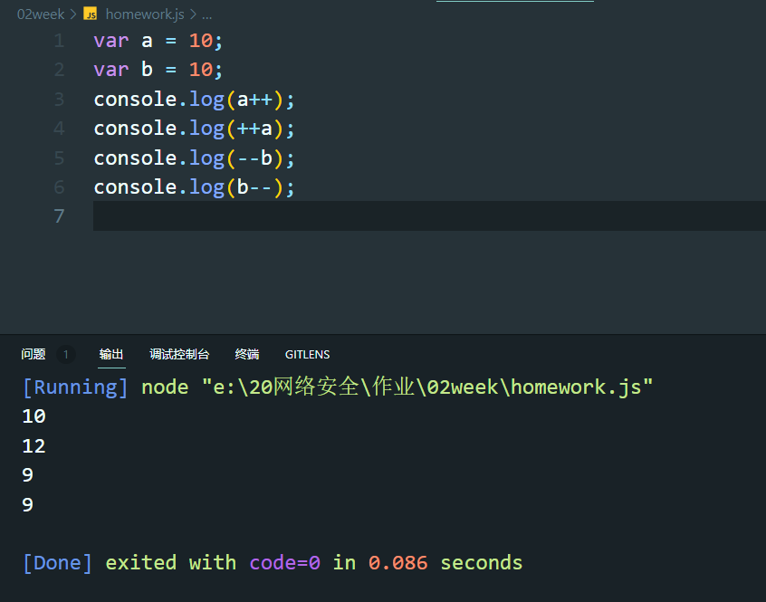

## 第二周作业
### 判断题
1. Java 是编译型语言。
   > 错，Java既不是编译型语言，也不是解释型语言

2. Javascript 中，不区分大小写字母，也就是说 A 和 a 是同一个变量。
   > 错，区分大小写

3. Javascript 中的常量包括 String、Number、Boolean、Null、Undefined。
   > 错，常量只包括String、Number、Boolean

4. String 字符串的语法中既可以使用单引号，也可以使用双引号。
   > 对

5. typeof 是用来判断变量类型，不可以当作运算符使用。
   > 错

6. 任何值和 undefined 运算，undefined 可看做 0 运算。
   > 错，null可以和任何值运算，null可以看做0运算，另外任何数据类型与undefined运算都会是NaN

### 请分别描述下列代码中“+”的作用。
```javascript
console.log(“年龄:” + 20); // 连字符
console.log(11+22+33); // 运算符，表示数字加
console.log(“网络 + 安全”); // 仅仅是符号
var a = 1;
var b = 2;
console.log(“a” + b); // 连字符
var a = 1;
var b = 2;
console.log(“a + b”); // 仅仅是符号
```

### 计算下述代码的打印值
```javascript
var a = 10;
var b = 10;
console.log(a++); // 10
console.log(++a); // 12
console.log(--b); // 9 
console.log(b--); // 9
```


### 分别使用行内式、内嵌式、引入外部文件的方法造成网页弹窗，要求触发弹窗的 JavaScript 命令不止一种（alert、print、prompt）。
> 详情见homework.html

### 安装 Docker 并练习以下基础命令、帮助命令、镜像命令和容器命令:
#### 帮助命令
```bash
docker 命令 --help
```
镜像## 帮助命令
```bash
docker images 列出所有镜像
docker search 搜索镜像
docker pull 下载镜像
docker rmi 删除镜像
```


