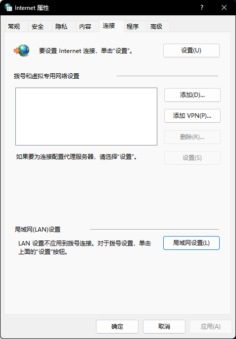
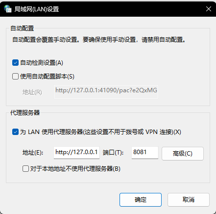
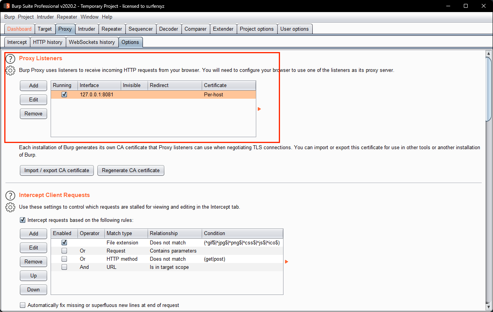
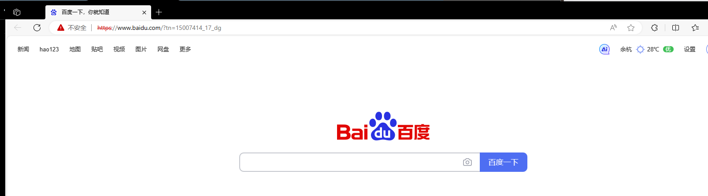
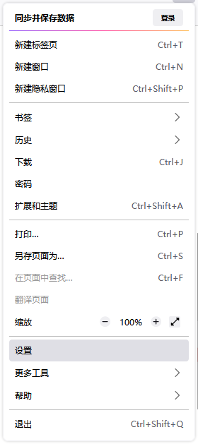
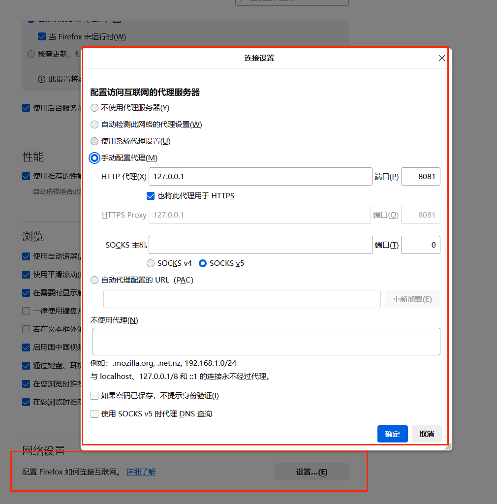
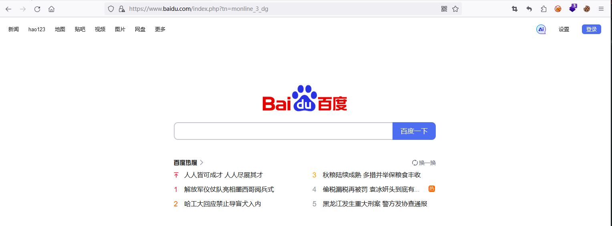
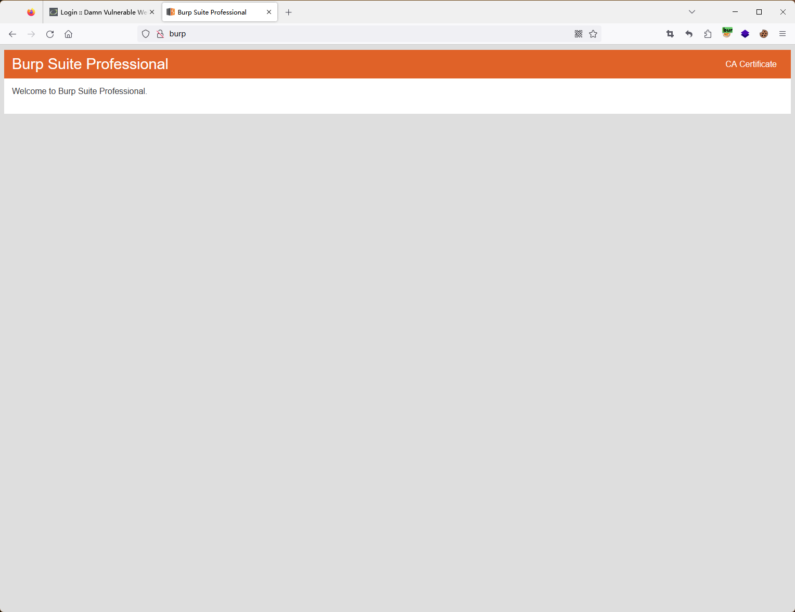

## 第五周作业

### 分别使用 AWVS 和 Xray（被动扫描模式）去扫描任一 SRC 允许测试的目标，对比扫描结果的不同；

#### AWVS
- 扫描http://testphp.vulnweb.com
- 说明：主动扫描，可以配置扫描范围，在AWVS的报告里会记录漏洞风险等级，攻击详情，漏洞描述，请求以及一些其他的详细信息，但是现在很多网站使用了安全防护设备，AWVS通常会被WAF拦截下来，所以该扫描器一般用于公司内网。
> 详见 [20230910_Quick_http_testphp_vulnweb_com_.html](./20230910_Quick_http_testphp_vulnweb_com_.html)

#### Xray
- 扫描http://testphp.vulnweb.com
- 说明：xray的被动扫描模式是点击目标站点的某个模块就扫描哪个模块（模拟用户点击），并且在xray的报告里会记录请求以及漏洞类型，xray会修改请求发送给目标站点服务端。但是Xray被动扫描不够全面，也会有不够合规的风险（可以通过配置尽可能满足合规要求），可以与BurpSuite协作，绕过WAF的限制。
> 详见 [xray-testphp.html](./xray-testphp.html)

### 使用 Nessus 扫描任一主机，要求使用全端口扫描，提供主机扫描报告；
扫描主机：121.196.62.22
主机扫描报告：[nessus主机扫描报告.html](./nessus主机扫描报告.html)

### 安装 Burp，分别在本机上实现全局代理和局部代理，提供设置过程的说明文档；
全局代理：
在win11系统下
1. Internet选项
   
2. 设置局域网
   
3. 设置BurpSuite
   
4. 访问目标站点
   

局部代理：
在Firefox火狐浏览器下
1. 设置代理
   
2. 网络设置
   
3. 同全局代理的第三步
4. 访问目标站点
   
   
### 利用 Burp 实现对 HTTPS 站点的抓包。
在本机以及浏览器安装CA证书即可对https站点进行抓包

