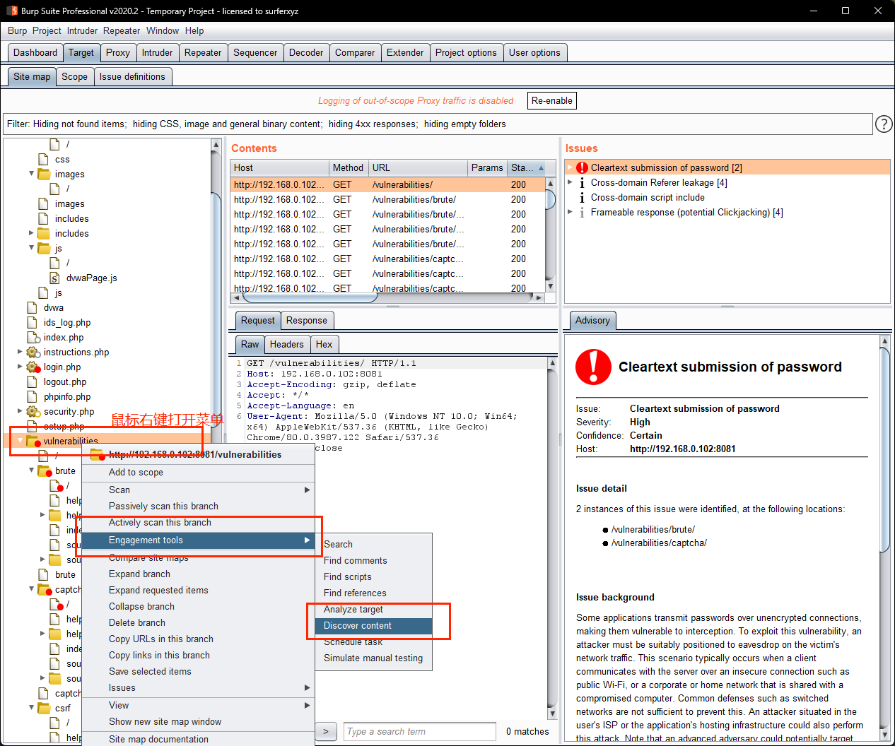
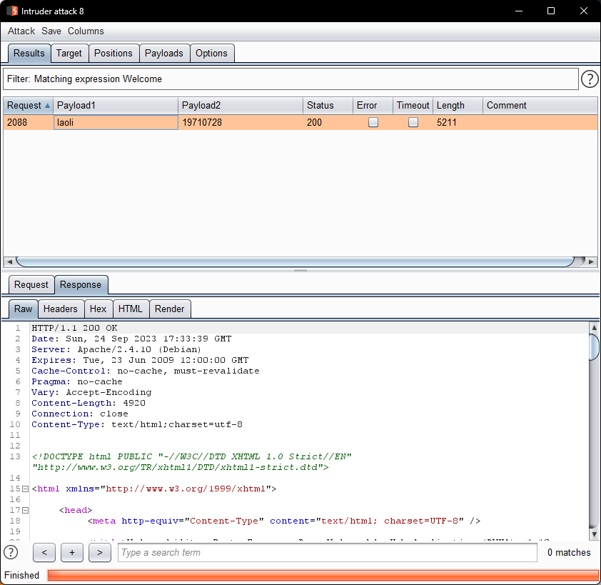

## 第六周作业

### 使用 Burp 的 Discover Content 功能爬取任意站点的目录，给出爬取过程的说明文档、站点树截图
1. 打开 Discover Content
   
2. Discover content扫描
   
3. Discover content扫描出的站点地图
   

### 分别使用 Burp Scan 的主动扫描和被动扫描功能对 DVWA 站点进行扫描，输出扫描报告
扫描站点：http://192.168.0.102:8081
扫描报告：[burp_scan扫描报告.html](./burp_scan扫描报告.html)

### Burp Intruder 爆破题目

#### 老李今年 52 岁了，他最近也在学习网络安全，为了方便练习，他在 DVWA 靶场中增设了一个自己的账号，密码就是他的生日，请你想办法破解出他的账号密码。
靶场地址： http://121.196.62.22:8082/vulnerabilities/brute/

1. 进入靶场
   
2. 打开Burp代理
   
3. 进入Burp Intruder
   
4. 设置Burp Intruder
   4.1. Target
   
   4.2. Positions
   Attack Type设置为Cluster bomb【集束炸弹爆破】模式，把username和password设为payload填充的位置，其中根据设置的顺序，1为username，2为password(这个与Payloads选项卡中的payload set顺序有关)
   
   4.3. Payloads
- payloads1即username的爆破字典，根据题目设置为一个[自定义字典custom_dictionary.txt](./custom_dictionary.txt)
   ```
   admin
   Admin
   geektime
   geektime1971
   Geektime
   Geektime1971
   root
   laoli
   li
   Li
   ```
   
- payloads2即password根据题目设置爆破密码，判断payload type应该为Dates，并且日期范围为19710101-19711231
   
   4.4 Options
   
5. 爆破成功
   爆破成功，找到老李的账号密码如下：
   username:laoli
   password:19710728
   
   

#### Cookie 老师在 DVWA 靶场中设置了一个账号 Geektime（注意首字母大写），且在靶场中的某处存放了一个文件名为 geekbang.txt 的密码字典，请你想办法找到该字典并尝试爆破，最终获取到账号 Geektime 的正确密码。
1. 找到密码字典[geekbang.txt](./geekbang.txt)
2. Burp Intruder的Attack Type设置为Sniper，并且只对password进行爆破
   
3. Payloads导入geektime.txt密码字典
   
4. 爆破成功
   爆破成功，找到Geektime的账号密码如下：
   username:Geektime
   password:geektime666
   
   

### 在不依赖于 DVWA 后端数据库的情况，如何通过前端验证的方法判断 DVWA 中的注入点是数字型注入还是字符型注入？（提示：用假设法进行逻辑判断）
- 假设输入 1 and 1=1 查询有两种情况：
1. 数字型注入
   1.1 站点本身不对用户输入做任何处理，可以查询到结果
   1.2 站点本身对用户输入做了处理，有隐式转换，能查到结果
2. 字符型注入
   2.1 站点输入字符串，查询不到预想的结果

- 假设输入 1 and 1=2 查询有两种情况：
  1. 数字型注入
   1.1 站点本身不对用户输入做任何处理，查询不到结果
   1.2 站点本身对用户输入做了处理，有隐式转换，能查到结果

综上所得，该注入点应该是数字型注入，且站点对用户输入做了处理。


